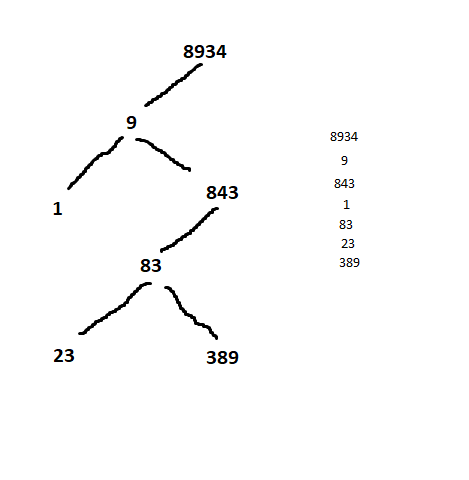
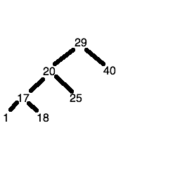

# com421
Work from Data Structures, Algorithms and Mathematics (COM421)

## Week 2

Classes - classes are complex data type which provide a way to define our own custom data structures, for example we could create a stack class which will represent a stack or a linkedlist class to represent a linked list. Classes have two key components:

    Methods. A method is an action that can be performed with a class. For example, with a stack class, we could define push and pop methods. For a linked list, we could define an addNode method, to add a node onto the end of the linked list (and update the reference to the last node).

    Attributes. An attribute is an item of data associated with the class. Last week, we saw that a stack uses an array to store its data. So an attribute of a Stack class could be the underlying array. Likewise, a linked list contains references to the first and last nodes in the list. So these could be attributes of the LinkedList class.

### Objects

Object - an object is an instance of a class. For example Polititian could be a class and the objects of the class would be Donald Trump and Joe Bidan. Objects is a specific example of a data structure.


For example you could define a LinkedList class, and then have one LinkedList object to store students at a university, another to store courses, and on and on.

Stack into a class

```python
class stack:
    # __init__ means: is a method used to initialise objects of the class. When creating a class we need to initialise objects of it in some way. sets the internalArray to a blank array ready to start pushing things onto it
    
    # (self) means: refers to whatever current object is being delt with. when we call a method or create an object we can access that object (the current object) through this self paramiter
    def __init__(self):
        #this bellow is technically an array - the [] creates a python list (it is more flexible than an array) FOR THE EXERCISE WE DONT WANT IT TOO COMPLEX
        self.internalArray = []
    
    def push(self, item):
        #code to add an item into the stack
        
    def pop(self):
        #code to remove an item from the top
        
    def __str__(self):
        return self.internalArray.__str__()

    # __str__ means: This is used if we want to print out the stack (the class), if we create an object and print it by default nothing will happen besides memory printed. to actually have something printed we need to have a __str__ method to define how its printed. when this is printed we want to return to the outside the internalArray of the stack
        
```

## Week 3

#### Queues

A queue works as a FIFO (First in First Out) just like a real-world queue
Tasks in a queue are known as "Jobs" - one of the realworld uses of a queue would be a printer queue

Uses a wrap around function where the next item will start to be added to the front if the back is full. (Needs to keep track of the current indice it's on) Queues are essentially circles that wrap around and around...for instance 0, 1, 2, 3, 4, will wrap around and look like 
                                                        0, 1, 2, 3, 4, 0, 1, 2, 3, 4,


## Week 4

#### Hash Tables

Hash tables allows us to look up values using non-numerical indices or Keys, we might want to implement an address book in which names are the keys and the addresses are the values...another example is student records where the student ID is the key and the full student record is the value.

Looping through a full array to look for an item is inefficient, for instance if there are say 10000 items in an array the searching for an item at 9990 would be super slow. we call this an O(n) operation where n is the index of the item and the performance of the search will depend on the index of the item in the array.

To do better and have a more efficient way of looking up data we can use hash tables. A hash table is an efficient data structure which uses keys (indices) that are converted to a numerical hash code using a mathematical function. This hash code is used to look up items in an array. The has code will be used as the arrays index.


#### Example

simple example for has tables, a simple has function might simply add the ascii codes of the characters making up the key, We might want to use a dictionary program storing words as the keys and their meanings as the values.

    e.g for the key "cat" - summing the ASCII codes gives 99+97+116 = 312 -For the key "dog" - we get 100 + 111 + 103 = 314
    For the key "rat" - we get 114 + 97 + 116 = 327

The has code returned from the hash function can then be used as the array index. We would place the key/value pair "cat" and "Furry animal which goes meo" at index 312 and the underlying array. "dog" would be 314 and "rat" would be 327

#### Problem:

If we enter "act" we will have a problem, the hash function for "act" would be 97+99+116 which equals 312 which is the same as "cat"...clashing, there are two common solutions to clashing, separate chaining and linear probing.

#### Separate Chaining

In separate chaining the array will contain buckets. each item will be given a hash code and placed into the bucket for the hash code. One bucket can contain more than one item.... for instance "cat" and "act" would be placed in the same bucket due to them having he same hash code.. Each bucket would contain a list of items at each entry of the array.

#### Linear Probing

Linear probing is an alternative approach where each array index contains only one item (Not a list). If there is a clash the item is movbed on to *The next available place in the array" so in the example above, "cat" and "act" would have a hash code of 312. Since "act" is the second item to be added it will then be moved from 312 to 313 giving it its own position.

#### Secondary Hash Function

To minimise cluster in linear probing you can use this function to calculate displacement and increase the number of places in the array. 
for example if the secondary hash function gives 7 for "act" we would place "act" at 312 + 7 = 319
    Secondary hash functions typically involve a modulo calculation for example:
                        (secondaryHash = sumOfAsciiCodes % N)

"s" is our string.
"s[0]" = the ascii code of position 0 in the string
"s[1]" = the ascii code of position 1 in the string
power off = ** in python
f = a number (anything) normally prime number...

s[0]*f^0 + s[1]*f^1 + ... + s[n-1]*(f^(n-1))


f = 10

"cat" vs "act"

99, 97, 116 (cat ascii)

(31 is the best number to use...prime number)
(10 would be replaced with 31...So 99*31^0...etc)

"cat" 99*10^0 + 97*10^1 + 116*10^2 = 99*1 + 99*10 + 116*100 = 99 + 970 + 11600 = 12669

97, 99, 116 (act ascii)

"act" 97*10^0 + 99*10^1 + 116*10^2 = 97*1 + 99*10 + 116*100 = 97 + 990 + 11600 = 12687

Our array should be a prime number, if for instance you are storing student data for around 100 students..to minimise clashes you want to give your array a capacity greater than the number of records you are likely to store (127).now we can do a modular calculation on the hash table...

(Some say make your underline array twice as big as the maximum number of items you will need to store you should minimise clashes)

12669 % 127 = 96 (thats the bucket that the item will go into) "cat"

12687 % 127 = 114 (thats the bucket that the item will go into) "act"


#### Why use a prime array size?

If our hash codes are truly random there wont be a need for a prime bucket size..the problem is in certain cases we will want to store the data numerically related.. for example memory addresses are often multiples of 4 because of how data is stored...so if we want to calculate a hash code for a variable based on memory address it means all our hash codes will be a multiple of 4 which will be a poor choice because clashes will be very likely... All buckets which are multiples of 4 will fill up but all the other buckets will stay empty. This can be generalised: if the hash codes end up being multiples of some number n, then choosing a hash code which is also n or a multiple of n will end up with more clashes than expected by chance. its better to choose a prime number to avoid this... and even if hash codes are not related in any way its a good practice.


#### Implementation details

N/A


## Week 5

#### Trees

A Tree is similar to a real tree but in reverse...The Root would be at the top and the child notes would be connected downwards from the root. A tree is a sequence of nodes.

Used when we need to arrange data hierarchically we would use trees. for instance html, the page body is the root node and the child nodes would be the headers or paragraphs.. Trees can also be used to do efficient searching and sorting of data...or the use with a scene graph.. Used in graphical application (games) so 3D objects for instance a horse might have a rider object where the rider would be the decendant of the horse because he is attatched to the horse (the rider is a child node) so if the horse moves the rider will move together with its parent (the horse)

#### Binary Trees

Binary tree is a form of a tree where each node will have only two child nodes, a left and right node..
This makes them useful for sorting data for instance.

This is probably best illustrated by example. Imagine you want to sort the numbers 29, (20), (17), 40, 25, (18), 1. How might you do that with a binary tree?

- You put the first number (i.e. 29) in the root node of the tree
- The next number ((20)) so we compare it to the parent node since its less than (29) it will be placed as the left child node
- Now ((17)) is less than (29) so we will go to the left node but that is occupied with (20) so we will go down another level and compare (17) with ((20)) and since ((17)) is less than ((20)) it will be added to the left node of ((20)).
- The fourth number (40) is bigger than 29 which means it will get placed to the right child node (of 29)..
- The next is (25) which is less than 29 so we put it on the left but (20) is there so it will compare 25 with (20) and 25 is bigger than (20) so 25 will get placed on the right as the right child node.
-The next number is (18) which is less than 29 so it goes to the left node to (20)..its also less than (20) so it goes to the left of (20) where (17) is but (18) is bigger than (17) so we add (18) to the right node of ((17)).
- The last is 1 so itll go all the way down to (17) and is added as the left node of (17).

#### Exercise
On paper, create a binary tree containing these numbers in order:

                                                    8934 9 843 1 83 23 389



#### Retrieving data in sorted order

Start at the root node.
Descend to the left child node.
If it has child nodes of its own:
    first descend its left child node and print out the value within;
    print out the value within this node;
    then descend its right child node and print out the value within.
If it does not have child nodes of its own, simply display the value within.

Repeat the process with the right child node of the root.

What do we do if the left child node's own left child node also has child nodes? We simply repeat the process and keep going until we finally hit a node with no child nodes of its own.



The 29 node has two child nodes, 20 and 40, so we descend to 20 first.
The 20 node has two child nodes, 17 and 25, so we descend to 17 first.
The 17 node has two child nodes, 1 and 18, so we descend to 1 first.
1 has no child nodes, so we just print out 1 and ascend to its parent (the node containing 17)
Having dealt with the left child of the node containing 17, we print out the value itself (17) first, then descend to the right node (18)
The 18 node has no child nodes, so we just print out 18
We then ascend back to the 17 node. The 18 node was the right node of the 17 node, so we are done processing this branch of the tree. So we go back up again to the 20 node.

We have dealt with the left branch of the 20 node, but not the right. This means we first print out the value, 20 and then descend the right node.

The right node of 20 contains a value, 25, but no child nodes of its own so we just print out the value (25)
We then ascend back to the parent, 20, as we are done with this branch.
We have also covered all branches of 20, so we ascend back up to the root node, 29.
We have dealt with the left branch of the 29 node, but not the right. This means we first print out the value, 29 and then descend the right node.

The right node of 29 contains a value, 40, but no child nodes of its own so we just print out the value (40)
We then ascend back to the parent, 29, as we are done with this branch.

We have now covered the left branch, the value, and the right branch of the root node. This means we are done with the tree. If you track back the order in which the values were printed, you'll find they are in order:

                                                            1 17 18 20 25 29 40


#### Recursion

Recursion is the process of a function calling itself over and over again until a condition is met...for instanec this is some code to print out the numbers 1 to 10 using recursion.

```python
def recursive_print (value, max_value):
    print(value)
    if value < max_value:
        value += 1
        recursive_print(value, max_value)

recursive_print (1, 10)
```

#### Using recursion on a binary tree (Algorithm)

- Starts at the Root node:
        Descends left branch (recursive function)
        Print the value in the node.
        Descend the right branch (recursive function)
- For each node we get to (for example the immediate child nodes of the root node), perform the first three steps again:
        Descend the left branch, if it exists
        Print the value in the node.
        Descend the right branch, if it exists


## Week 7

#### Algorithm efficiency: the "Big O" notation

In algorithms we need to measure how comples an algorithm is (efficiency)..Complexity can be measured in many ways such as performance (time taken) or the usage of memory... The standards for measuring algorithm complexity we use The Big O notion... This expresses complexity in relation to some property (the data we are dealing with) "n"... n is often the size of data (the amount of data) for exampel a list n would be the amount of items in the list (The longer the list the slower or more complex the algorithm would be )... With algorithm efficiency we have to consider worst case senarios

Big O notation is expressed in terms of this property "n"...For Example:
    O(1): if an algorithm is O(1) it means that its complexity is independent of n. Calculating the memory address of the index of an array     would be an example of an O(1) operation because it is always given by the equation:
    
```python
memory_address = start_memory_address + index * bytes_used_by_one_item
```

    Clearly the time taken to evaluate this equation does not depend on the size of the list, which is the property n in this case. Even if the list is very large, and the index is very large, we can quickly calculate the item's address using the simple equation above. O(1) algorithms are thus highly efficient… but not many algorithms are O(1)!

    O(n):  If an algorithm is O(n) it simply means that the complexity depends on the value of "n"(Directly or linearly)...If n was increased by 2 the complexity will also increase by another 2...for example linked lists is an O(n) algorithm because we will have to manually follow the links to retrieve the item in the list with a specific index...we cannot rely on memory addresses...

The Worst-case scenario is simply that we assume the index would not be found until the end of the list where n is the number of items in the list..

    O(n^2): (^Indicates a power) when na algorithm is O(n^2) then it means the time takne or memory used will be influenced by the square of the number of items...So if the number of the items doubles then the time taken will increase around four times or if the number is increased by 10 this means the time taken will be increased by 100 times

Algorithms in which we have an outer and inner loop which will loop through the array twice would be an O(n^2) algorithm..the outer loop will be run "n" times and the inner loop will be run "n" times...For example an outer and inner loop. A function do_something() is performed n^2 times (16 times in the example, as n is 4). If n is changed to 5, then the operation will be performed 25 (5^2) times.

```python
n = 4
for i in range (n):
    for j in range (n):
        do_something(i, j)
```
As can be seen this is not very efficient..

Big O notation is used to classify algorithms...so we have O(n^2) but we dont have and never will O(n^2) + 1 for complexity...Even if the time taken would be n^2 + 1 we wouldnt show it as that but instead as O(n^2).

Any compelxity equation that has n^2 in the equation means they can be approximated (simplified) simply to O(n^2)...


The diagram below shows how complexity increases with increasing n for different classes of Big O complexity:

    n is along the x (horizontal) axis, while the complexity is along the y (vertical) axis;
    green is O(n);
    red is O(n^2);
    blue is O(log n); to be discussed below;

    magenta is the quadratic equation 0.5*n^2 + 0.5n. This shows that the quadratic form is exhibited, and the shape of the graph, with a rapid increase with the rate of increase getting bigger with larger values of n is very similar to n^2. (This is known as a parabolic graph). So, even if the complexity is not exactly O(n^2), the behaviour of the graph for increasing n is essentially the same as O(n^2).


 This is known as a Parabolic Graph...


    O(log n): When algorithms are O(log n) O is related to the log of n...Logarithm is the inverse operation of a power...A log of a number (relative to a particular base, such as base 10 or base 2) will give you the power the base has to be raised to to equal that number...so if b to the power of p is x then log(b)x = p....(log explained)


    b^p = x ----> log(b) x = p

From this we can see that the O(log n) operation is far more efficient because we can increase n significantly but the consumed time or memory will not increase too significantly... For example if we were to use it on a list of 256 (2^8) items it will only take twice as long as a list of 16 (2*4) ...compared with that of a O(n) algorithm which will take 16 times longer because 16 x 16 is 256....


#### Sorting Algorithms...

##### Bubble Sort


